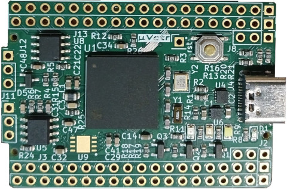
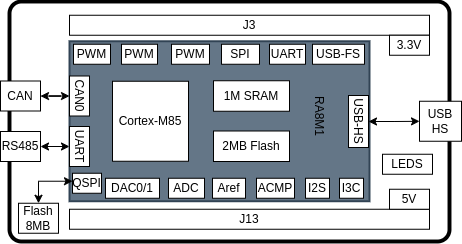
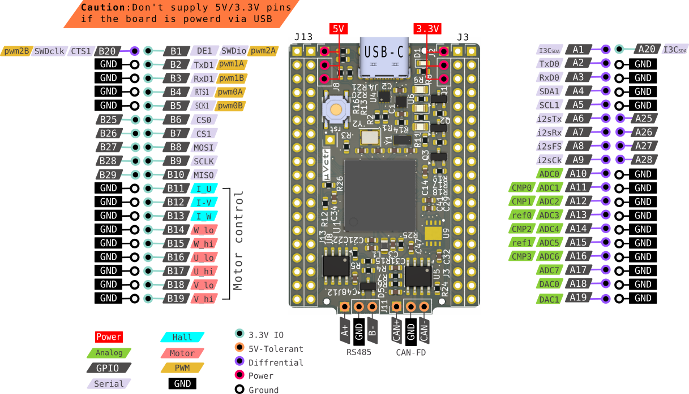
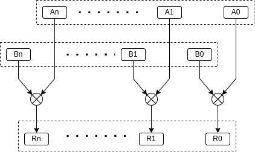
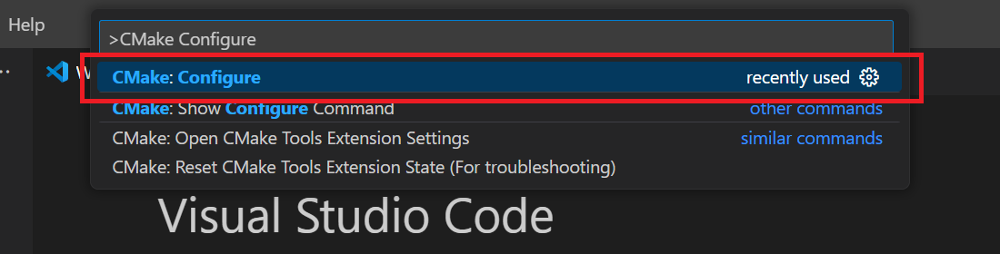
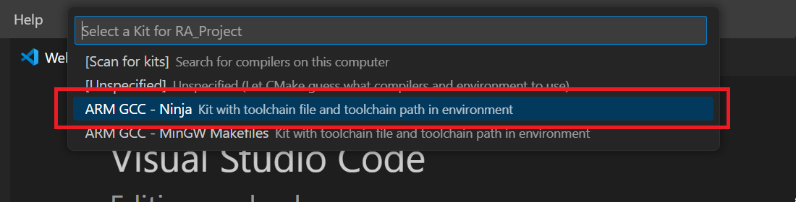

# MicroVEctor Board
----------------------------------------------
## Introduction


MicroVEctor (µV) Board is an open-source platform designed for advanced embedded applications, delivering exceptional performance through the ARM Cortex-M85 core with Helium MVE (**M-Profile Vector Extension**) technology. The µV board is an ideal platform for developers looking to leverage vectorization into their embedded applications. With its advanced peripherals and connectivity options, industrial-grad design and user-friendly open-source development environment.

The µV platform provides extensive peripherals, including **USB-HS**, **CAN-FD**, **RS-485**, **I3C**, **I2C**, **I2S**, **UART**, and **QSPI**, and advanced **High-speed ADCs and DACs and comparators**  ensuring seamless integration with diverse systems. while advanced PWM and timer/capture peripherals enables **Field-Oriented Control (FOC)** and direct drive of **BLDC** and **3-phase induction motors**.

Engineered for industrial and automotive environments, it offers an **extended operating temperature range** and **Error Correction Code (ECC)** Memory for enhanced reliability in noisy conditions.
 

<!-- <div style="text-align: left; display: grid; grid-template-columns: 1fr 1fr;"> -->
<!-- <div style="text-align: center;"> -->
<br> 


The µV board relies on **VS Code** for development, and support both **GCC** and **Clang** compilers. It includes extensive peripheral template projects to simplify peripherals integration into your applications. Developers can easily debug directly within VS Code. The board supports both **Bare-metal** and **RTOS** environments and integrates **CMSIS libraries** for advanced DSP and neural network functionalities.

---------------------------------
## Hardware Details
<br>  <br> <br> <br>
- Arm® Cortex®-M85 core
  - ARMv8.1-M architecture profile with Helium M-profile Vector Extension (MVE)
  - Floating Point Unit (FPU), single, and double-precision floating-point operation.
  - M-profile Vector Extension (MVE) Integer, half-precision, and single-precision floating-point MVE (MVE-F)
  - Maximum operating frequency: 480 MHz
  - industrial grade.

- Memory
  - 2 MB code flash memory, 12 KB data flash memory.
  - 1 MB SRAM, 128 KB of TCM (Tightly Coupled Memory) ECC memory.
  - (optional) QSPI 16Mb flash.

- Connectivity
  - UART Asynchronous interface  up to 60 Mbps. (2-ports)
    + Multi-Processor Communication Function.
    + Noise Cancellation Function.
    + RS-485 Driver Control Function. (2 ports)
    + Smart card interface
    + Manchester coding support.
  - LIN (1-port)
  - I2C bus interface IIC (1-port).
  - I3C bus interface I3C (1-port).
  - CAN with Flexible Data-rate CAN-FD (2-ports).
  - Serial Peripheral Interface (SPI) up to 60 Mbps (1-port)
  - Serial Sound Interface Enhanced (1-port).
  - USB 2.0 High-Speed Module USB-HS 480 Mbps (1-port).

- Analog
  - 12-bit A/D Converter (ADC12) × 2
  - 12-bit D/A Converter (DAC12) × 2
  - High-Speed Analog Comparator (ACMPHS) × 2
  - Temperature Sensor (TSN)

- Timers
  - General PWM Timer 32-bit × 8 channels.
  - General PWM Timer 16-bit  × 6 channels.
  - BLDC, AC-induction 3-phase generator.
  - Hall sensor tachometer counter.
  
- Board level I/O
  - 32-GPIOs, 5-V tolerance, open drain, input pull-up, switchable driving ability.
  - GPIOs multiplexed with analog, comms, and timers functions.
  - RS485 transceiver.
  - CAN-FD transceiver.
  - LEDs (3 leds).
  - Boatloader :UART
  - SWD debug interface.

----------------------
### Pinout


&nbsp;
&nbsp;
<div 
style="text-align: center;">
  <div>  </div>
</div>
&nbsp;
&nbsp;


--------------------------
## Helium


The Arm Helium extension, also known as the M-Profile Vector Extension (MVE), a part of the Armv8.1-M architecture provides a significant performance boost for almost any embedded coding task by introducing advanced vector processing capabilities. Here's how it works:

**Vector Processing**: Helium uses Single Instruction Multiple Data (SIMD) to perform the same operation on multiple data points simultaneously. This is achieved through 128-bit vector registers that can handle multiple elements of the same data type in parallel. As illustrated in the figure below, Helium can process four 32-bit floating-point numbers in a single instruction cycle. This parallelism is particularly beneficial for applications like machine learning (ML) and digital signal processing (DSP), where large datasets are common.



alternatively, Helium can process 8 16-bit integers or 16 8-bit integers in a single instruction cycle. This flexibility allows developers to choose the most suitable data type for their specific application.

**Increased Throughput**: By processing multiple data points in parallel, Helium significantly increases the throughput of ML and DSP tasks. This can lead to up to 15 times performance improvement for ML functions and up to 5 times for signal processing functions compared to previous implementations.

**Low Overhead Branch (LOB) Extension**: This feature reduces the overhead associated with loops and branches, making the execution of repetitive tasks more efficient. The Low Overhead Branch (LOB) extension in the Armv8.1-M architecture is designed to optimize loop execution, which is crucial for  signal processing and machine learning applications. Without LOB, each iteration would involve multiple instructions to update the loop counter and branch back to the start. With LOB, these operations are streamlined, resulting in faster and more efficient loop execution.


**Reduced Latency**: The optimized instruction set and low overhead branching reduce the latency of critical operations, making real-time processing more feasible.

---------------------------
## Writing vectorized loop

Vectorization can be utilized into your code via either auto-vectorization or Helium intrinsics: 
- **Helium Intrinsics**: Use when you need fine-grained control over vectorization or when the compiler cannot optimize the loop automatically.
- **Auto-Vectorization**: Use for simpler loops where the compiler can efficiently generate SIMD instructions.
- **Combining both techniques**: can maximize the performance of your embedded applications using the Helium MVE extension.


Below, we will explore how to manually implement SIMD victorized code using Helium intrinsic functions. Let's multiply two float vectors A,B element by element : 

$$
 \newcommand\mycolv[1]{\begin{bmatrix}#1\end{bmatrix}}
 C = A x B = \mycolv{a_i\\a_j\\a_k\\...}  x \mycolv{b_i\\b_j\\b_k\\...} = [ (a_i x b_i) , (a_j x b_j ) , (a_k x b_k) ...]
$$


### Using Helium Intrinsics

Helium intrinsics provide direct access to the Helium instruction set, enabling you to write optimized SIMD code without delving into assembly language. These intrinsics are defined in the **arm_mve.h** header file and allow you to perform operations like loading, multiplying, and storing data in parallel.


Helium Intrinsics are compiler-recognized functions. These intrinsics enable direct access to the Helium instruction set without requiring hand-written assembly code. Programmers can utilize Helium as needed directly from C/C++ code, bypassing many low-level engineering complexities.


The following intrinsics will be used:
- **vldrwq_f32** Loads consecutive elements from memory into a destination vector register.
- **vmulq_f32** Vector float32 Multiply elements in vector registers.
- **vstrwq_f32** Stores consecutive elements to memory from a vector register.
[See interactive list of all the Helium intrinsic functions](https://developer.arm.com/architectures/instruction-sets/intrinsics/)

In this example We will be able to perform 4 parallel float multiply operation at single cycle. So we have to make sure that the length of the vector operands are multiple of 4 32-bit floating-point values, since Helium registers are 128 bits wide.

This function, `vector_mult`, performs element-wise multiplication of two floating-point arrays. Let's build the code step by step:


1. **Function Parameters**
   ```c
   void vector_mult(float32_t *restrict a, float32_t *restrict b, float32_t *restrict c, uint32_t size)
   ```
   - `a`, `b`: Input arrays containing floating-point numbers.
   - `c`: Output array where results are stored.
   - `size`: Number of elements to process.

   The `restrict` keyword tells the compiler that these pointers are **not aliased**, meaning they won’t overlap in memory. This allows the compiler to optimize memory accesses.

2. **Pointer Initialization**
   ```c
   float32_t *pSrcA = a;
   float32_t *pSrcB = b;
   float32_t *pDst  = c;
   ```
   These pointers are used to navigate the arrays during computation.

3. **Defining Block Size**
   ```c
   const int blkSize_F32 = 4;
   int blkCnt = size / blkSize_F32;
   ```
   - ARM MVE works with **vector registers** of 4 `float32_t` values.
   - `blkCnt` calculates how many **full 4-element blocks** exist in the array.

4. **Processing Blocks in a Loop**
   ```c
   while (blkCnt > 0U) {
   ```
   This loop runs until all blocks have been processed.

5. **Loading Data**
   ```c
   float32x4_t vecA = vldrwq_f32(pSrcA);
   float32x4_t vecB = vldrwq_f32(pSrcB);
   ```
   - float32x4_t data type : holds holds four 32-bit float data in vector registers.
   - `vldrwq_f32(pSrcA)`: Loads 4 floating-point values from `pSrcA` into a vector register.
   - `vldrwq_f32(pSrcB)`: Loads 4 floating-point values from `pSrcB` into a vector register.

6. **Performing Multiplication**
   ```c
   float32x4_t vecDst = vmulq_f32(vecA, vecB);
   ```
   - `vmulq_f32(vecA, vecB)`: Multiplies corresponding elements from `vecA` and `vecB`.

7. **Storing Results**
   ```c
   vstrwq_f32(pDst, vecDst);
   ```
   - `vstrwq_f32(pDst, vecDst)`: Writes the computed vector back into memory at `pDst`.

8. **Updating Pointers**
   ```c
   pSrcA += blkSize_F32;
   pSrcB += blkSize_F32;
   pDst  += blkSize_F32;
   ```
   - Moves the pointers to the next 4-element block.

9. **Decrementing Block Counter**
   ```c
   blkCnt--;
   ```
   - Ensures the loop exits after processing all blocks.

**Performance Benefits**
- Uses SIMD (Single Instruction, Multiple Data) to process **four** numbers at once.
- Reduces loop overhead, making execution **faster**.
- Efficiently loads/stores data using **vector instructions**.


```c
#include <arm_mve.h>
void vector_mult(float32_t *restrict a, float32_t *restrict b, float32_t *restrict c, uint32_t size) {
  float32_t *pSrcA = a;
  float32_t *pSrcB = b;
  float32_t *pDst  = c;

  const int blkSize_F32 = 4; // Number of elements processed per iteration
  int blkCnt = size / blkSize_F32;

  while (blkCnt > 0U) {
    // Load vectors from memory
    float32x4_t vecA = vldrwq_f32(pSrcA);
    float32x4_t vecB = vldrwq_f32(pSrcB);

    // Perform vector multiplication
    float32x4_t vecDst = vmulq_f32(vecA, vecB);

    // Store the result back to memory
    vstrwq_f32(pDst, vecDst);

    // Update pointers for the next iteration
    pSrcA += blkSize_F32;
    pSrcB += blkSize_F32;
    pDst  += blkSize_F32;

    blkCnt--;
  }
}
```


### Auto-Vectorization

Auto-vectorization allows the compiler to optimize loops for SIMD execution automatically. By writing clean and simple loops, you can enable the compiler to generate vectorized instructions without manual intervention.

**Example: Auto-Vectorized Loop**

```c
void vector_mult(float32_t *restrict a, float32_t *restrict b, float32_t *restrict c, uint32_t size) {
  for (uint32_t i = 0; i < size; i++) {
    c[i] = a[i] * b[i];
  }
}
```

When compiled with optimization flags, the compiler will generate SIMD instructions for the loop. For example, the assembly output might include instructions like `vldrw.32`, `vmul.f32`, and `vstrw.32`, indicating that the loop has been vectorized.


**Using GCC toolchain**
```c
13 | void vector_mult(float32_t *restrict a, float32_t *restrict b, float32_t *restrict c, size_t length) {
14 |   for ( int i = 0; i < length; i++ )
15 |   {
16 |     c[i] = a[i] * b[i];
17 |   }
18 | }
```

in the compilation output, the optimizer indicates the loop is optimized with 16-bytes
```bash
./src/hal_entry.c:14: optimized: loop vectorized using 16 byte vectors
```

**Using Clang toolchain**
```c
27 | void vector_mult(float32_t *restrict a, float32_t *restrict b, float32_t *restrict c, size_t length) {
28 |   #pragma clang loop vectorize(enable)
29 |   for ( int i = 0; i < length; i++ )
30 |   {
31 |     c[i] = a[i] * b[i];
32 |   }
33 | }
```

in the compilation output, the optimizer indicates the loop is optimized with 16-bytes
```bash
[build] ./src/hal_entry.c:29:5: remark: vectorized loop (vectorization width: 4, interleaved count: 1) 
```


For both toolchains : *Four parallel* floating point 32-bit multiplication operations are executed each cycle. Let's inspect the hal_entry.c.a file which contains the assembly code output from the optimizer.

```c
  @ <your_code>.c:16: c[i] = a[i] * b[i];
  vldrw.32  q3, [r1], #16
  vldrw.32  q2, [r2], #16
  vmul.f32  q3, q3, q2
  vstrw.32  q3, [r3], #16
```
The optimizer uses three assembly vector instructions :

- **vldrw.32** : loads four 32-bit operands from memory (r1, r2 pointers) into vector registers q2,q3.
- **vmul.f32** : vector multiply integers from q2,q3 registers and store the results in q3.
- **vstrw.32** : write back the content of q3 into memory(r3 pointer).


### **Benchmarking your code**
The ARMv8-M architecture includes the Data Watchpoint and Trace (DWT) unit, which provides various debugging and profiling capabilities, including a cycle counter. The cycle counter allows developers to measure execution time of code sections by counting processor cycles.

**ARMv8-M DWT Cycle Counter Overview**
The **DWT Cycle Counter**:
- Is part of the **DWT unit** in Cortex-M processors.
- Increments every clock cycle, making it useful for precise performance measurements.
- Can be accessed via the **DWT_CYCCNT** register.
- Needs to be enabled via the **DEMCR** and **DWT_CTRL** registers.

**How to Use the DWT Cycle Counter to Profile Code**
Below is an example of how to use the cycle counter:

```c

    DEMCR |= (1 << 24);  // Enable DWT
    DWT_CTRL |= 1;       // Enable DWT cycle counter

    uint32_t start = DWT_CYCCNT; // Read start cycle count

    // Code section to profile
    vector_mul();

    uint32_t end = DWT_CYCCNT; // Read end cycle count
    uint32_t cycles_elapsed = end - start;
    


```
**DWT cycle counter helps you**:

- Calculate execution time from clock frequency and the measured cycle count.
- check **loops**—high cycle counts might indicate inefficient iterations.
- Investigating **memory access**—slow access might suggest poor cache utilization.
- **Measure Interrupt Latency** before and after an interrupt to evaluate system responds to events.


--------------------------------------------------------------------------------
## Compiling and Building application

**Setup the project**
1. Open vscode and [installing Renesas vscode extension](https://tool-support.renesas.com/e2studio/vscode/docs/installation.html) or from [marketplace](https://marketplace.visualstudio.com/items?itemName=RenesasElectronicsCorporation.renesas-build-utilities)
2. from vscode marketplace install mcutools  and arm-debug tools.
3. Download the latest [arm-gnu-toolchain](https://developer.arm.com/downloads/-/arm-gnu-toolchain-downloads).
4. Download [ARM Clang toolchan](https://github.com/arm/arm-toolchain/releases).
5. Download and uncompress [Renesas FSP](https://www.renesas.com/en/software-tool/flexible-software-package-fsp).
6. Clone the [uV-board repository](https://github.com/ahmad-hamza/uv).
7. Open the project folder in vscode.


**Peripheral drivers**

example driver file for each peripheral are available at the driver folder. copy the required files into the the /src folder in your project and modify as per your application.


**Compiling the code**

You can use either **GCC** or **Clang** to compile the code. The following steps will guide you through the process of compiling the code using both toolchains.

1. open the [Command Palette] in VSCode and select [CMake: Configure] from the commands. 
2. If you missed the CMake Kit selection, re-select the CMake Kit by running “CMake: Select a kit”.
3. After the configuration is complete, open the command palette again and select "CMake: Build" to compile the project. 
    - If you are using the ARM GCC toolchain, select the "ARM GCC - Ninja" kit.
    - If you are using the ARM Clang toolchain, select the "ARM Clang - Ninja" kit.
4. Select the build type (Debug or Release) and the build directory (e.g., `build`).
    - The build directory is where the compiled files will be generated.
    - The default build directory is `build`, but you can change it to any directory you prefer.
    - The build type can be either Debug or Release, depending on your needs.
5. Now, go to and click “Terminal” => “Run Build Task” from the menu.
6. Build options will be shown, select the “Build Project” option.


---------------------------------------------------------------------------------------------------
## Debugging and DFU


### MCUBoot

µV-board comes pre-programmed with MCUBoot, which runs from flash and enables firmware upgrades without the need for jtag/swd. MCUBoot structures internal flash into partitions:
1. boot_partition	for MCUBoot itself.
2. primary_partition : primary slot for the user application image.
3. secondary_partition : secondary slot for the user application image.
4. scratch_partition : used for swapping images when doing a firmware upgrade.

**Flashing the application using MCUmgr** 
MCUmgr is used to communicate with the MCUBoot inside the device. steps to download the user binary code:
- install the mcumgr tool. (you need to have GO language installed)
```go
go install github.com/apache/mynewt-mcumgr-cli/mcumgr@latest
```
- navigate to the build directory of your application, where the <your_code>.bin image is located.
- Connect the µV-board to PC using USB type-c connector.
- Run the following command:
```
$ mcumgr image upload <your_code>.bin --conntype=serial --connstring="dev=<com-port>,baud=115200"
```
  - The <com-port> on Windows can be e.g. COM4. The board will be flashed with the <your_code>.bin image. 
- Press the reset button to activate the internal MCUBoot.
  - mcumgr waits for 10 seconds for the MCUBoot to respond (use -t <timeout> to adjust this value). 
- when mcumgr finishs Press the reset button to start the application.

 **Restoring MCUBoot Via RFP**

If you lost the MCUboot you can restore it to the board again using serial. this can be done via RFP tool from Renesas available for Windows / Mac / Linux.

- Download [Renesas RFP software](https://www.renesas.com/en/software-tool/renesas-flash-programmer-programming-gui)
- Connect a USB-serial cable to (TxD1,RxD1 on J13).
- connect the USB-serial RTS pin to the reset pin in uV board.
- Connect USB to provide power to board.
- Navigate the bootloader folder from the µV-Board folders.
- run the rfp-cli command:
```bash
rfp-cli -d RA -if uart -s 115200 -bin bootloader.bin
```
- where <path> 
### SWD
- Firmware can be uploaded via USB-FS DFU on J13 pins B1, B20.
- debugger pins swdclk, swdio are avaliable at J13 conncector pins 
- install cortex debug extension.
- from vscode open menu Run->open configurations. or click on launch.json.
- select add configuration button at the bottom right 
- from the dropdown list selsct the debugger you want.
- st-link, jlink, openOCD, PyOCD are supported.
- save and close the file
- Select Run->Start debugging or press F5.

you can also use SWD to upload the MCUBoot, to restore the MCUBoot Run: 
```bash
rfp-cli -d RA -if swd -s 1.5M -bin bootloader.bin
```


### Console
  By default serial console is avaliable via USB type-C as VCOM USB-CDC-ACM using connection parameters:
  + Baud Rate: 115200bps.
  + Data: 8 bit.
  + Parity: None.
  + Stop bits: 1 bit.
  + Flow Control: none.

Alternatively Uart9 available at (TxD1,RxD1 on J13) ccan be used as the default serial console to use it comment the #define USBHS_CONSOL in src/common.h file.

----------------------------------------------
